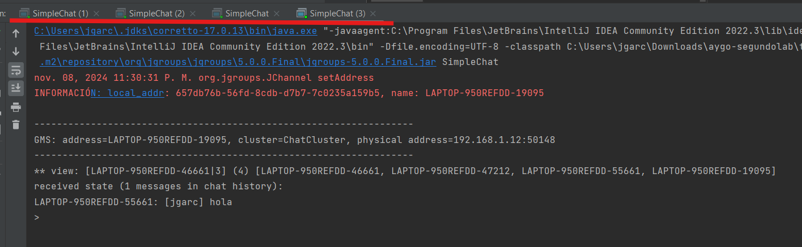
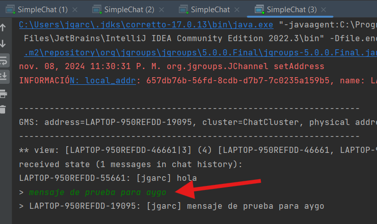
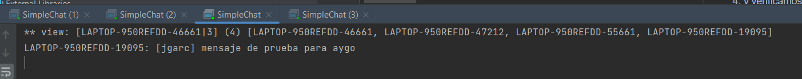
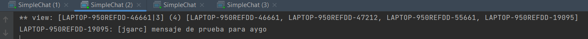
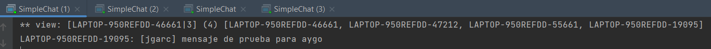

# SimpleChat

SimpleChat es una aplicación de chat de consola que utiliza JGroups para gestionar la comunicación en un entorno de clúster. Permite a los usuarios enviar y recibir mensajes entre múltiples nodos dentro de una red. Este proyecto demuestra conceptos fundamentales de sistemas distribuidos, incluyendo la sincronización de estados y la difusión de mensajes.

## Arquitectura

La arquitectura de SimpleChat se basa en `JChannel` de la biblioteca JGroups:
- **JChannel**: Actúa como canal de comunicación entre instancias de SimpleChat, permitiendo la difusión y recepción de mensajes dentro de un clúster llamado `ChatCluster`.
- **Interfaz Receiver**: La clase `SimpleChat` implementa `Receiver`, que gestiona los mensajes entrantes y sincroniza el historial del chat entre los nodos del clúster.
- **Bucle de Eventos**: El método principal escucha de forma continua las entradas del usuario y las envía como mensajes al `ChatCluster`.

### Componentes

1. **Configuración de JChannel**: Inicializa el canal JChannel y configura un receptor para gestionar los mensajes.
2. **Envío y Recepción de Mensajes**: Utiliza `ObjectMessage` de JGroups para difundir mensajes a otros nodos en el clúster.
3. **Sincronización de Estado**: Al unirse, los nodos recuperan el estado actual del chat para mostrar los mensajes previos en el clúster.

### Dependencias
- Java Development Kit (JDK) 8+
- [Biblioteca JGroups](https://www.jgroups.org/) para la gestión de comunicación en clústeres.

## Configuración del Proyecto

1. **Clonar el Repositorio**:
   ```bash
   git clone <URL_DEL_REPOSITORIO>
   cd SimpleChat
   ```

2. **Agregar JGroups a tu Proyecto**: Asegúrate de que la biblioteca JGroups esté en el classpath.

3. **Compilar el Código**:
   ```bash
   javac -cp .:jgroups-4.0.0.Final.jar SimpleChat.java
   ```

## Ejecución

Para iniciar la aplicación, ejecuta el siguiente comando:
```bash
java -cp .:jgroups-4.0.0.Final.jar SimpleChat
```

Al unirse a un clúster, la instancia recuperará el estado actual del historial del chat y mostrará los mensajes previos.

## Instrucciones para Despliegue y Pruebas

### Despliegue
Para ejecutar SimpleChat en un entorno distribuido:
1. Asegúrate de que los nodos en el clúster estén en la misma red.
2. Ejecuta SimpleChat en múltiples terminales o máquinas para crear una sesión de chat distribuida.

3. para verificar que la ejecucion fue correcta podemos enviar un mensaje desde cualquier instancia y evidenciar com ose replica en las otras

4. y verificamos las otras instancias
-
-
-